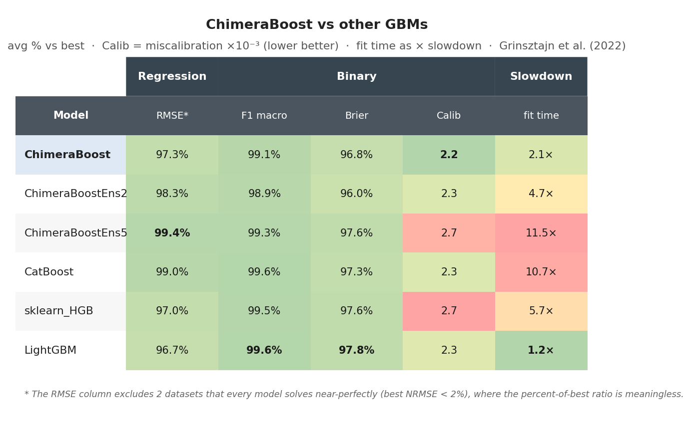

# chimeraboost
### What if CatBoost, but way faster, slightly worse, and all in Python?


* **What?**
    * GBDT library that only depends on common Python libraries
    * Supports regression, binary and multiclass classification, quantile regression
    * Categorical features, sample weights, and automatic early stopping
    * Within ~3% F1 / ~5% RMSE of CatBoost on a 34-dataset OpenML benchmark, at ~18× the speed

* **Why?**
    * I want to be able to modify my GBDT library at will
    * I know Python and I don't know C

* **Install**

```
pip install chimeraboost
```

* **How?**

```python
from chimeraboost import ChimeraBoostClassifier, ChimeraBoostRegressor

# classification
clf = ChimeraBoostClassifier(early_stopping=True)
clf.fit(X, y, cat_features=[0, 1], sample_weight=w)
proba = clf.predict_proba(X_test)

# regression (RMSE, MAE, or Quantile)
reg = ChimeraBoostRegressor(loss="Quantile", alpha=0.9, early_stopping=True)
reg.fit(X, y)
```

* **Some parameters**

| Param | Default | What it does |
|---|---|---|
| `iterations` | 500 | Max boosting rounds (capped earlier by early stopping). |
| `learning_rate` | auto | Per-round shrinkage; auto-picked when `None`. |
| `depth` | 6 | Oblivious-tree depth (same split applied across each level). |
| `l2_leaf_reg` | 3.0 | L2 regularization on leaf values. |
| `max_bins` | 128 | Quantile bins per numeric feature. |
| `cat_n_permutations` | 4 | Ordered target-statistic permutations for categoricals. |
| `early_stopping` | False | Auto train/validation split; stop when val stops improving. |
| `cat_combinations` | False | Generate pairwise categorical combo features (helps all-cat datasets). |

* **Benchmark**



* **Reproduce the benchmark**

```
python benchmarks/run_benchmarks.py --openml --seeds 5 --save
python benchmarks/make_tables.py benchmarks/results/<stamp>.json
```

Results land in `benchmarks/results/<stamp>.txt` (text log) and `.json` (raw per-seed metrics). Table PNG is written to `images/`. Competitors are auto-detected; install any of `catboost`, `xgboost`, `lightgbm` to see them.
